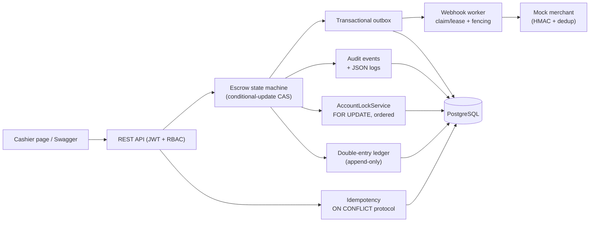

# PayNova — Escrow Payment Platform

[](https://github.com/yichen057/paynova-escrow/actions)

> A portfolio-grade **sandbox escrow payment platform**. It implements production-inspired
> ledger, idempotency, concurrency control, transactional outbox, security, and audit
> patterns. **It does not process or custody real funds.**

Escrow flow: buyer funds an order → platform holds the money in a system escrow account →
buyer confirms → funds released to seller (or refunded). Modeled after early marketplace
payment systems, built as one Spring Boot modular monolith on one PostgreSQL.

## Why this project is not another CRUD demo

| # | Problem | Mechanism |
|---|---------|-----------|
| 1 | Duplicate HTTP requests | Idempotency records + unique constraint (`ON CONFLICT DO NOTHING`) |
| 2 | Concurrent state transitions on one order | Conditional UPDATE (CAS, `affected_rows == 1`) |
| 3 | Balance double-spend | PostgreSQL pessimistic row locks, always acquired in ascending account-id order |
| 4 | Money conservation | Immutable double-entry ledger + system accounts; per-currency global SUM = 0 |
| 5 | State/ledger consistency | Single database transaction |
| 6 | Payment succeeded but notification lost | Transactional outbox + claim/lease worker with `claim_token` fencing |
| 7 | Security traceability | Audit events + SIEM-ready structured JSON logs |

Full specification: [`docs/DESIGN_v1.2_EN.md`](docs/DESIGN_v1.2_EN.md) (Source of Truth; the original Chinese design document is in the same directory).

## Quick start

```bash
cp .env.example .env          # then set JWT_SECRET (generate: openssl rand -base64 32)
docker compose up --build     # app on :8080, PostgreSQL on :5433
# Demo cashier: http://localhost:8080/cashier.html
# Swagger UI:   http://localhost:8080/swagger-ui.html
```

There is deliberately no default JWT secret — the app fails fast without one.
Set `SPRING_PROFILES_ACTIVE=json` to switch console logs to SIEM-ready JSON
(one object per line, correlation_id and source_ip included).

## Tests

```bash
mvn test      # unit tests (no database)
mvn verify    # + integration tests on real PostgreSQL via Testcontainers (Docker required)
```

All key guarantees are enforced by 64 automated checks (33 unit tests + 31 integration
tests on real PostgreSQL via Testcontainers), not claimed:

- Ledger entries always balance — per-transaction Σ(debit)=Σ(credit), global per-currency SUM = 0
- The same `Idempotency-Key` replayed 10× moves money exactly once, with verbatim response replay
- Two concurrent $80 payments from a $100 wallet — exactly one succeeds (pessimistic locking)
- Concurrent double-release of one escrow order — exactly one winner (conditional-update CAS)
- Illegal state transitions rejected with zero side effects; append-only ledger enforced by a DB trigger
- Webhook delivery retries with exponential backoff; consumer-side dedup keeps effects exactly-once

## Status

- [x] Step 0 — skeleton: schema (9 tables), JWT auth, Docker Compose, CI
- [x] Step 1 — escrow state machine (CAS)
- [x] Step 2 — double-entry ledger + system accounts + top-up
- [x] Step 3 — request-level idempotency
- [x] Step 4 — account locking + money endpoints
- [x] Step 5 — transactional outbox + webhook worker

In progress: audit-event module (SIEM-ready structured logging), demo assets, deployment.

## Architecture

V1 is deliberately a **modular monolith** — one Spring Boot application, one PostgreSQL:



The security architecture this project implements the core of was designed first
(STRIDE threat model, IAM, SIEM pipeline, PCI-DSS zoning) — see
[docs/target-architecture.png](docs/target-architecture.png). Evolution mapping:

| V1 module (this repo) | Target-architecture component |
|---|---|
| Spring Security + JWT + RBAC | API Gateway auth + IAM (MFA/RBAC/SSO) |
| escrow + ledger modules | Payment API Service + Transaction Engine |
| Transactional outbox + worker | Kafka async messaging |
| audit events + JSON logs | Filebeat → Kafka → Logstash → Splunk SIEM |
| Idempotency-Key + HMAC webhooks | Interface security layer (HMAC signing) |
| Single PostgreSQL | Primary/replica in the CDE zone |

## Deployment

`render.yaml` is a ready-to-use [Render](https://render.com) blueprint (free tier):
create a managed PostgreSQL, point a Blueprint at this repo, fill in the three
`SPRING_DATASOURCE_*` values. `JWT_SECRET` is generated per deploy, never committed.

## Limitations (by design)

This is a **sandbox**: no real card/ACH/PayPal money movement, no storage of PANs/CVV,
no KYC/AML, no PCI-DSS or money-transmitter claims. The constraint is licensing and
regulation, not code. `system:cash_in` is a placeholder for external funding sources —
sandbox funds have no real monetary value.

---

*Built with AI-assisted development: design decisions, reviews, and break-it experiments
by the author; boilerplate scaffolding AI-assisted. See commit history.*
